# 🌙 SleepSafe: AI Sleep Addiction Recovery Coach

**Reprogram your nights. Reclaim your life.**

[](https://reactjs.org/)
[](https://tailwindcss.com/)
[](https://ai.google.dev/)
[](https://www.typescriptlang.org/)

---

## 💡 Overview

SleepSafe is an AI-driven wellness platform designed to help you overcome **late-night sleep procrastination**—the chronic cycle of staying up too late, mindlessly scrolling, watching, or working. We're not just another sleep tracker that shows you data after a bad night's sleep. SleepSafe is an **active intervention tool** that treats sleep procrastination as a behavioral pattern that can be understood and rewired.

Using principles from Cognitive Behavioral Therapy (CBT-I), an adaptive AI coach, and powerful habit-forming tools, SleepSafe helps you uncover the "why" behind your late nights and build a sustainable routine that restores your natural circadian balance. Our mission is to transform your digital devices from enablers of insomnia into intelligent guardians of your rest.

---

## 🧠 The Digital Night Trap: Why We Stay Up

Modern life has created a silent epidemic: the compulsion to delay sleep. This isn't just a lack of discipline; it's a complex psychological response to a high-stress, always-on world. Billions of people experience:

-   **Revenge Bedtime Procrastination:** Sacrificing sleep for the "me time" you didn't get during the day.
-   **Anxiety & Racing Thoughts:** The quiet of the night often amplifies worries, making it hard to switch off.
-   **The Dopamine Loop:** Social media, videos, and games are designed to be addictive, creating a cycle of "just one more minute" that can last for hours.

Traditional sleep apps only **track** the problem. SleepSafe is designed to **solve** it.

---

## ✅ The Solution: Your Personal Sleep Recovery System

SleepSafe combines AI-driven behavioral therapy, intelligent routine building, and progress tracking into a single, supportive ecosystem. It's your partner in the journey back to healthy, restorative sleep.

### ✨ Key Features

<details>
<summary>🧠 <strong>Mind Rewire: The AI Cognitive Coach</strong></summary>
<br/>
<p>At the core of SleepSafe is a conversational AI coach, powered by the Google Gemini API and trained on the principles of Cognitive Behavioral Therapy for Insomnia (CBT-I). This isn't just a chatbot; it's an empathetic partner designed to help you:</p>
<ul>
    <li>🗣️ <strong>Talk It Out:</strong> Use text or voice-to-text to chat about your day, your anxieties, and your sleep struggles in a judgment-free space.</li>
    <li>❓ <strong>Uncover Triggers:</strong> The coach asks gentle, reflective questions to help you identify the root causes and emotional triggers behind your sleep procrastination.</li>
    <li>🔄 <strong>Reframe Negative Thoughts:</strong> Learn to challenge and change unhelpful thought patterns like "I'm too wired to sleep" or "I need to stay up to decompress."</li>
</ul>
</details>

<details>
<summary>📊 <strong>Progress Hub: Track & Triumph</strong></summary>
<br/>
<p>Visualizing your progress is a powerful motivator. The Progress Hub turns your efforts into tangible data, reinforcing positive changes.</p>
<ul>
    <li>🎯 <strong>Set Bedtime Goals:</strong> Define a target bedtime to make your goal concrete and measurable.</li>
    <li>📈 <strong>Log Your Sleep:</strong> Quickly log your sleep duration, quality, bedtime, and any relevant notes.</li>
    <li>✅ <strong>Instant Feedback:</strong> See immediately whether you met your bedtime goal, creating a powerful feedback loop.</li>
    <li>📊 <strong>Visualize Patterns:</strong> A simple chart shows your sleep trends over time, helping you connect your habits to your sleep quality.</li>
</ul>
</details>

<details>
<summary>⏰ <strong>Routine Builder: Reminders & Streaks</strong></summary>
<br/>
<p>Consistency is the key to rewiring your body clock. These tools help you build and maintain a healthy pre-sleep routine.</p>
<ul>
    <li>🔥 <strong>Sleep Streak:</strong> Gamify your consistency! The app tracks your streak of consecutive nights logging your sleep, motivating you to stay on track.</li>
    <li>🔔 <strong>Smart Reminders:</strong> Create reminders for your wind-down activities (e.g., "Stop screen time," "Read a book," "Meditate").</li>
    <li>🔁 <strong>Recurring Tasks:</strong> Set reminders to repeat daily, weekly, or monthly to build an automatic, effortless routine.</li>
    <li>- 📲 <strong>Notifications:</strong> Get timely notifications on your device when a reminder is due, gently nudging you toward your goal.</li>
</ul>
</details>

<details>
<summary>🎵 <strong>NeuroSync Audio Lab: Retune Your Brain</strong></summary>
<br/>
<p>Break the cycle of scrolling with a library of soothing, science-backed audio designed to calm your nervous system.</p>
<ul>
    <li>🌊 <strong>Soothing Soundscapes:</strong> From rainforests to ocean waves, choose an ambiance that helps you disconnect.</li>
    - 🧠 <strong>Binaural Beats:</strong> Listen to frequencies designed to guide your brainwaves toward a state of deep relaxation and sleep.</li>
</ul>
</details>

<details>
<summary>🤝 <strong>Sleep Circles: Community Support (Vision)</strong></summary>
<br/>
<p>You're not alone on this journey. Connect with others in anonymized, AI-moderated small groups for peer motivation and emotional support.</p>
</details>

---

## 🛠️ How SleepSafe Breaks the Addiction Cycle

Sleep procrastination is a habit loop: a **Cue** (e.g., feeling stressed), a **Routine** (scrolling on your phone), and a **Reward** (temporary distraction). SleepSafe helps you break this loop and build a new, healthy one.

1.  **Identify the Cue (Self-Awareness):**
    *   The **AI Coach** helps you articulate the feelings and thoughts that trigger your desire to stay up late. By understanding the *why*, you can start to address the root cause.

2.  **Interrupt the Routine (Pattern Interruption):**
    *   **Smart Reminders** and **Notifications** act as external cues, breaking your autopilot mode and reminding you of your intention to wind down.
    *   **NeuroSync Audio** provides an alternative, healthier routine. Instead of opening a social media app, you can choose to listen to calming audio, replacing a stimulating activity with a relaxing one.

3.  **Create a New Reward (Positive Reinforcement):**
    *   **Sleep Streaks** and **Goal Tracking** create a new, powerful reward system. The satisfaction of maintaining a streak or seeing a chart full of "on-track" nights provides a dopamine hit that's aligned with your long-term goals.
    *   Logging **better sleep quality** in the app reinforces the ultimate reward: feeling rested, clear-headed, and emotionally balanced the next day.

By consistently applying these principles, SleepSafe helps you weaken the old, destructive habit loop and replace it with a new, positive one that leads to restorative sleep.

---

## 🏛️ System Architecture

The application is designed with a simple and secure client-side architecture. All your personal data is stored locally in your browser, ensuring complete privacy.

```mermaid
graph TD
    A[User] -- Interacts with --> B{React Frontend};
    B -- Manages UI State & Logic --> B;
    B -- Sends Prompts --> C[Google Gemini API];
    C -- Returns AI Responses --> B;
    B -- Reads/Writes Data --> D[Browser LocalStorage];
    A -- Receives Notifications --> E[Browser Notification API];
    A -- Provides Voice Input --> F[Web Speech API];
    F -- Transcribes Speech --> B;
    
    subgraph "Client-Side (Your Browser)"
        B
        D
        E
        F
    end
    
    subgraph "Cloud"
        C
    end

    style B fill:#20232A,stroke:#61DAFB,stroke-width:2px
    style D fill:#4A5568,stroke:#E2E8F0,stroke-width:2px
    style C fill:#4285F4,stroke:#fff,stroke-width:2px
    style E fill:#4A5568,stroke:#E2E8F0,stroke-width:2px
    style F fill:#4A5568,stroke:#E2E8F0,stroke-width:2px

```



---

## ⚙️ Technology Stack

This web application is built on a modern, scalable, and secure foundation.

-   **Frontend:** ⚛️ [React](https://reactjs.org/), 📘 [TypeScript](https://www.typescriptlang.org/), 💨 [Tailwind CSS](https://tailwindcss.com/)
-   **AI Core:** 🧠 [Google Gemini API](https://ai.google.dev/)
-   **State Management:** 🎣 React Hooks (`useState`, `useEffect`)
-   **Data Persistence:** 💾 Browser `localStorage` API
-   **Speech Recognition:** 🎙️ Web Speech API

---

## 🚀 Getting Started

To run this project locally, follow these steps:

1.  **Clone the repository:**
    ```bash
    git clone https://github.com/your-username/sleepsafe-app.git
    cd sleepsafe-app
    ```

2.  **Install dependencies:**
    ```bash
    npm install
    ```

3.  **Set up Environment Variables:**
    This project requires a Google Gemini API key. The application is configured to access the key from the `process.env.API_KEY` environment variable. Ensure this variable is present in your execution environment.

4.  **Run the development server:**
    ```bash
    npm run dev
    ```
    The application should now be running on your local server, typically `http://localhost:5173`.

---

## ⚖️ License

This project is licensed under the MIT License. See the `LICENSE` file for details.

> **SleepSafe — because healing starts when you finally let yourself rest.**
